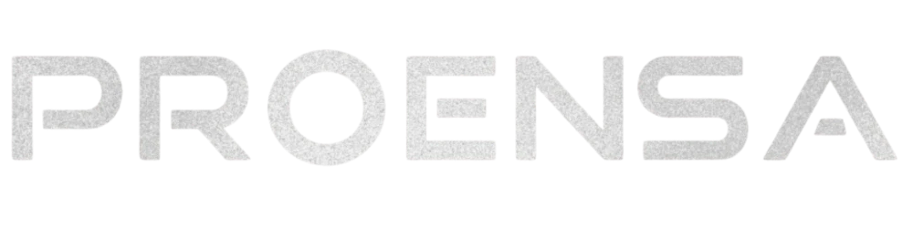

# 💠 Portfólio Proensa

> Portfólio pessoal de **Matheus Proensa** — Designer Gráfico & Front-end Developer. Single-page com identidade visual própria, estética premium e tecnológica, fundo interativo e microinterações. Desenvolvido com **React + TypeScript + Vite**.

<p align="center">
  
</p>

<p align="center">
  
  
  
  
</p>

---

## 📖 Sobre o projeto

O **Portfólio Proensa** reúne meus trabalhos de **design gráfico** e **front-end** em uma única experiência com direção visual autoral. A proposta é parecer um estúdio de marca — não um template: paleta azul elétrico → ciano sobre fundo navy profundo, glassmorphism, fundo interativo de constelação e um sistema visual consistente do hero ao rodapé.

🔗 **Repositório:** [github.com/MatheusProensa/portfolio-proensa](https://github.com/MatheusProensa/portfolio-proensa)

🌐 **Demo:** https://matheusproensa.vercel.app/

---

## 🖼️ Preview


## ✨ Funcionalidades

- 🌌 **Fundo interativo de constelação** — partículas conectadas em `<canvas>` que reagem ao movimento do mouse
- 🏠 **Hero** com nome + wordmark da marca, proposta de valor, CTAs e redes sociais
- 👤 **Sobre** com apresentação e selo de disponibilidade para projetos
- 🎯 **Áreas de atuação** — Design e Front-end, com stacks/ferramentas
- 🎨 **Projetos de Design** — identidades visuais (Proensa, Ponto Grão, Pako & Bella) que abrem em **modal de case study**
- 💻 **Projetos Front-end** — aplicações em React, também com modal de detalhes (descrição, papel, stack e link)
- ✉️ **Contato** com canais diretos e formulário
- ⏳ **Loader honesto** — some quando a página realmente carrega, sem atraso artificial
- ♿ **Acessibilidade** — navegação por teclado nos cards e modal (Enter / Espaço / Esc), `aria-label` nos ícones e foco visível
- 📱 **Totalmente responsivo** (desktop, tablet e mobile com menu hambúrguer)
- 🎬 Animações suaves de scroll, hover e microinterações

---

## 🛠️ Tecnologias

- **React 19** + **TypeScript**
- **Vite** (build e dev server)
- **react-icons** (Font Awesome)
- CSS puro com **design tokens** (variáveis CSS) — sem framework
- Tipografia: **Space Grotesk** (títulos) + **Inter** (corpo)

---

## 🚀 Como rodar o projeto

```bash
# 1. Clone o repositório
git clone https://github.com/MatheusProensa/portfolio-proensa.git
cd portfolio-proensa

# 2. Instale as dependências
npm install

# 3. Rode em modo de desenvolvimento
npm run dev

# 4. (Opcional) Gere a build de produção
npm run build
```

O projeto abre em `http://localhost:5173`.

---

## 📁 Estrutura de pastas

```
portfolio-proensa/
├─ public/
│  └─ favicon / ícones
├─ src/
│  ├─ assets/            # logo, wordmark, foto, capas de projeto, screenshots
│  ├─ App.tsx            # seções, fundo interativo, modal e dados dos projetos
│  ├─ App.css            # sistema visual (tokens, layout, componentes, animações)
│  ├─ index.css          # reset / estilos globais
│  └─ main.tsx           # entrypoint
└─ index.html
```

### Seções
`Hero` · `Sobre` · `Áreas de atuação` · `Projetos de Design` · `Projetos Front-end` · `Contato`

---

## 🎨 Sistema visual

O design é guiado por **design tokens** em variáveis CSS (`App.css`):

| Token | Uso |
|-------|-----|
| `--blue` `#2563eb` | Cor de destaque (botões, links, selos) |
| `--cyan` `#38bdf8` | Glow, hovers e fundo interativo |
| Fundo navy `#0b1120` | Canvas base da página |
| Cards "glass" | Fundo translúcido + blur + borda hairline |

---

## ♿ Acessibilidade

Navegação por teclado com foco visível, cards e modal operáveis via teclado (Enter / Espaço / Esc), `aria-label` nos ícones e botões, textos alternativos nas imagens e marco `<main>`.

---

## 👤 Autor

Desenvolvido por **Matheus Proensa** — Designer Gráfico & Front-end Developer.

- 📧 matheu.proensa@gmail.com
- 💼 [LinkedIn](https://www.linkedin.com/in/matheus-proensa-48082617b/)
- 🐙 [GitHub](https://github.com/MatheusProensa)
- 🎨 [Behance](https://www.behance.net/matheusproensa)
- 📍 Santa Maria — RS, Brasil

---

## 📄 Licença

Projeto pessoal de uso livre para fins de estudo e portfólio.
